# Project Manager

[](https://github.com/Boisti13/project-manager/actions/workflows/ci.yml)

A self-hosted task management application with hierarchical tasks (main tasks + subtasks), color-coded projects with categories, task comments, multi-user support, deadlines, search and filtering, a phone-friendly layout and in-app updates.

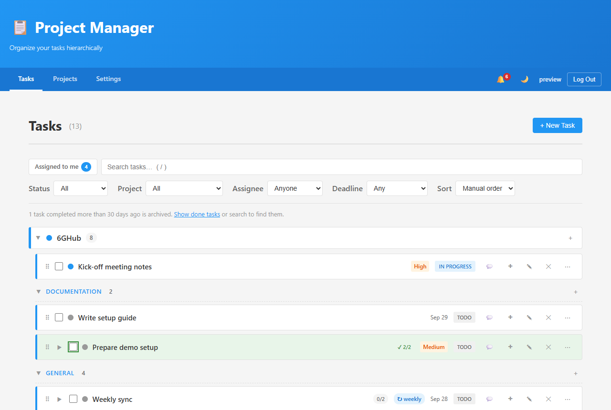

## Features

- **Authentication**: JWT-based login; the first account registered becomes the admin, after that self-registration is **closed** unless an admin allows it (Settings → User Management). New passwords need at least 8 characters; everyone can change their own password under Settings → *Your account*
- **User Management**: Admins add accounts, set passwords, promote/demote and activate/deactivate users (deactivated users are locked out immediately)
- **Hierarchical Tasks**: Main tasks with subtasks in a tree structure, drag-to-reorder at any level (in manual sort order) or **Move up / Move down** in each task's **⋯ menu** (works on touchscreens), **Move to…** another project or category (subtasks come along), subtask progress (e.g. *1/2*) on the parent; when all subtasks are ticked the parent is highlighted as ready (*✓ 2/2*) but stays open — it only moves to *Completed* when you tick it yourself, so more subtasks can still be added
- **Bulk Entry**: *Several (one per line)* in the task form — type or paste a list, indent lines (Tab or two spaces) to make subtasks at any depth; bullets and Markdown checkboxes (`- [x] done`) are understood, a live preview shows the resulting tree, and project, status, priority, deadline and assignee apply to all of them. Works from *+ New Task*, a project/category section's **+**, or a task's **+** (all lines become its subtasks)
- **Recurring Tasks**: *Repeat* every N days, weeks, months or years. Ticking a repeating task creates the next one with the deadline moved forward on its schedule (month ends handled, never already overdue) and its subtasks as a fresh checklist; shown with a ↻ badge
- **Done Checkbox & Archive**: Tick tasks off with a checkbox; they move into a collapsed *✓ Completed* row at the end of their project/category (most recent first). After a configurable number of days (Settings → *Completed tasks*, default 30) they're archived — hidden from the list but still found by search or the *Done* filter. Nothing is deleted
- **Multi-User**: Task assignment, per-user notifications
- **Comments**: Discussion thread on every task and subtask (💬 with count on the row); authors can edit (marked *edited*) and delete their comments, admins can delete any; search also finds tasks by comment text; comments travel with project export/import
- **Search & Filters**: Full-text search over titles, descriptions and comments (subtasks included), filters for status, project, assignee and deadline, sorting by deadline/priority/date/title; filters are kept in the URL
- **Projects & Categories**: Projects with one level of categories (e.g. *6GHub → General, Ordering, Documentation*), each project color-coded; the Tasks page lists tasks in collapsible sections per project and per category (remembered per browser), with every task carrying its project's color
- **Phone-friendly**: Bottom tab bar, two-line task rows with large touch targets and a ⋯ menu that opens as a bottom sheet (add subtask, edit, move, delete), folding filters, no input zoom on iOS; installable via *Add to Home Screen* (web app manifest) to run full-screen like an app
- **Extended Status**: todo / in_progress / blocked / done
- **Notifications**: The bell tells you when someone **assigns you a task** (a bulk add counts as one) or **comments on a task** you're assigned to or have commented on, plus overdue and due-within-3-days deadlines of your (and unassigned) tasks. Unread items are highlighted; clicking one jumps to the task — opening its project, category and parents, and its comments
- **Assigned to me**: One click next to the search shows only your tasks, with a count of your open ones
- **Dark Mode**: Toggle in the nav, persisted per browser, defaults to OS preference
- **In-app Updates**: Settings shows the running version/branch/commit; anyone can check a branch for updates, admins can update or switch branches (backup, pull, migrate, rebuild the frontend, sync the Nginx config, restart) with a live log
- **Backups & Restore**: Automatic database backup before every update; *Back up now*, download, delete, upload and one-click **restore** (with automatic safety backup and rollback) in Settings for admins; keeps the newest N (default 3). Move a whole instance to a new server by restoring a backup there — also straight from the Proxmox helper script
- **Export & Import**: Export a project (with categories, tasks, subtasks) or everything as JSON and import it into another account or installation; CSV export of all tasks for Excel — see [DEPLOYMENT.md](DEPLOYMENT.md#backups--export)
- **Self-Hosted**: One-command install on Proxmox VE (creates the LXC for you) or into any Debian/Ubuntu LXC/VM, no Docker

## Screenshots

| Desktop | Phone |
|---|---|
| 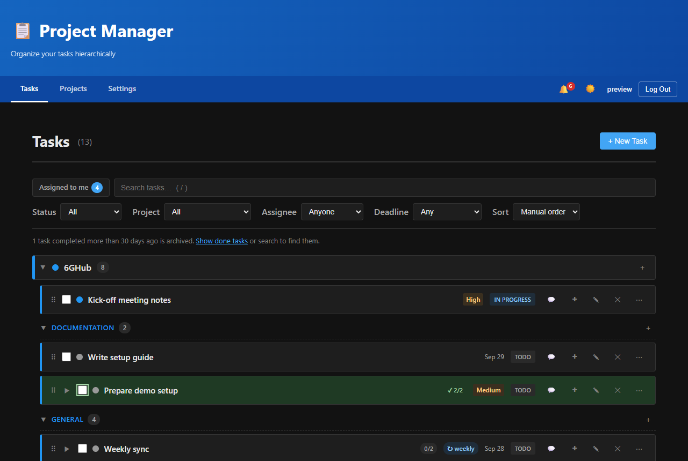 | 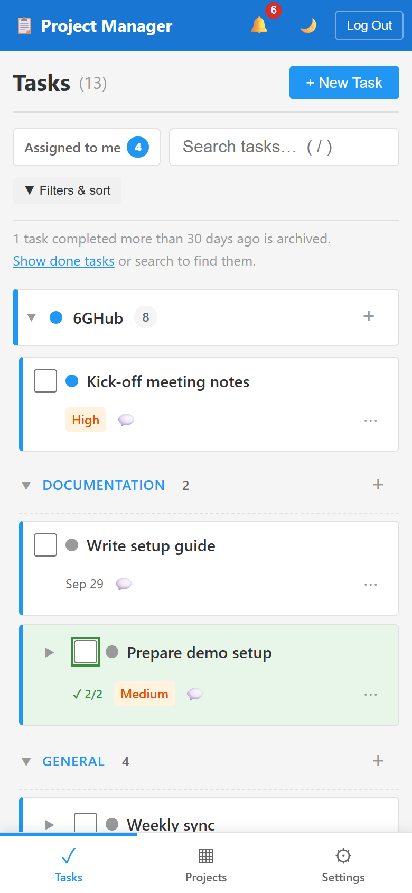 |
| 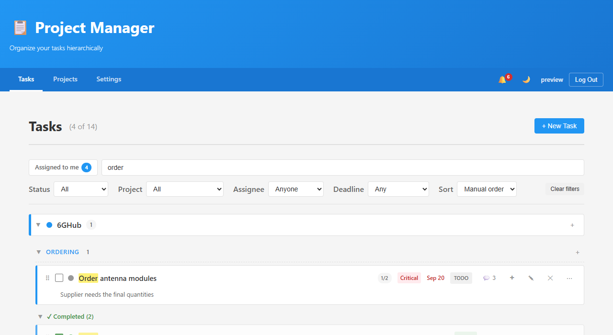 | 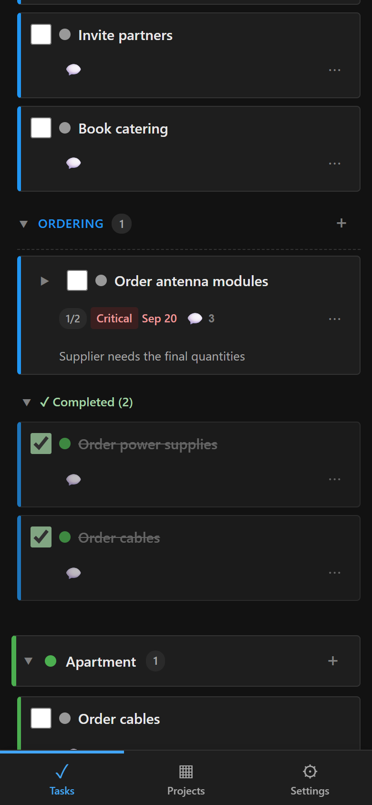 |
| 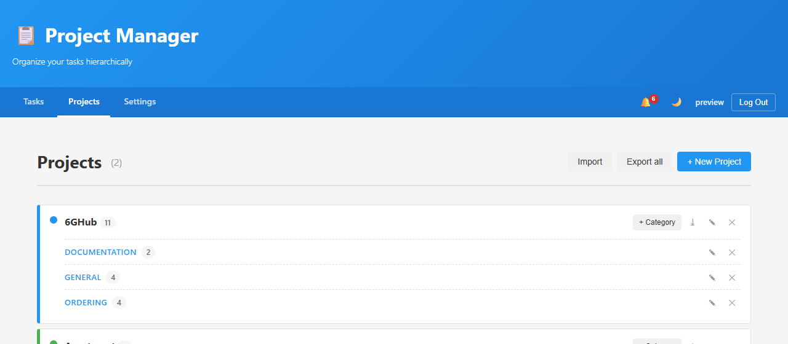 | 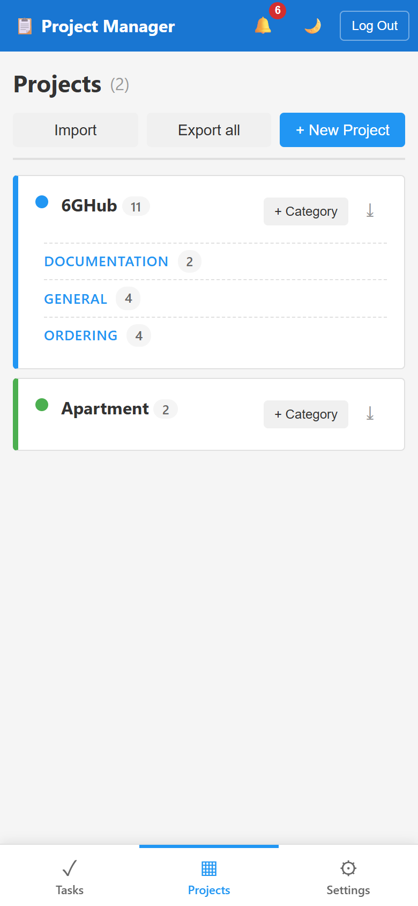 |
| 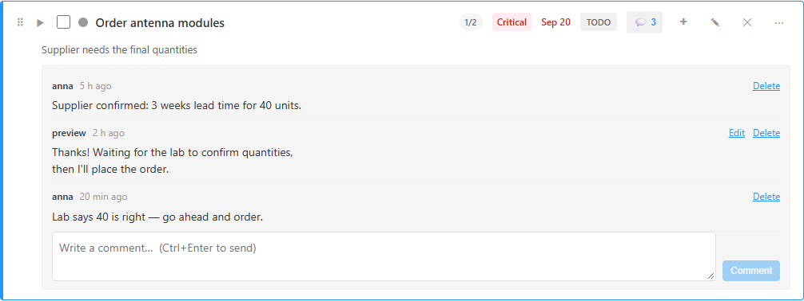 | 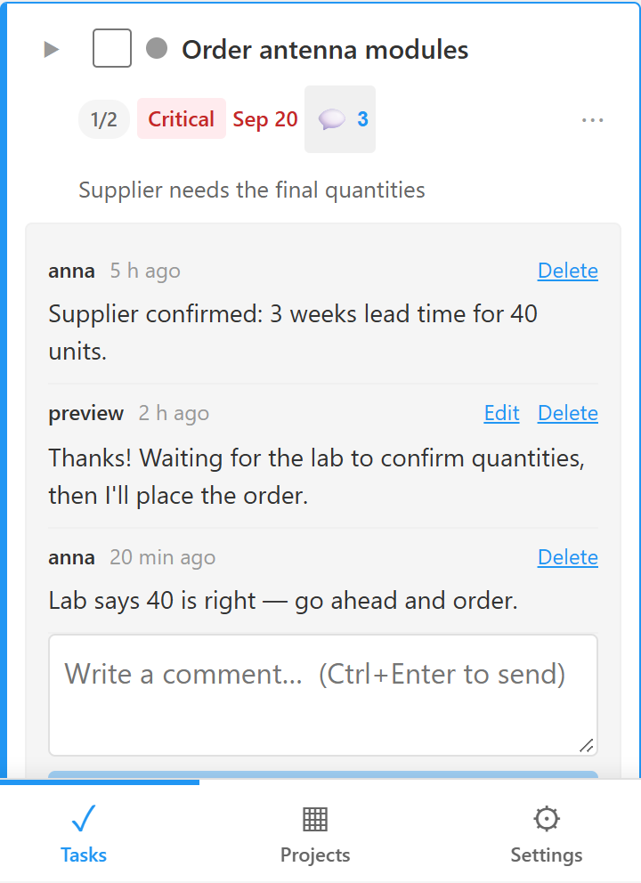 |
| 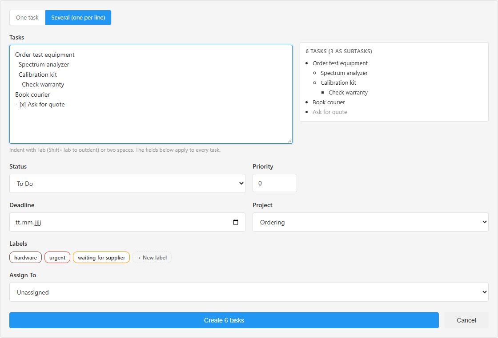 | 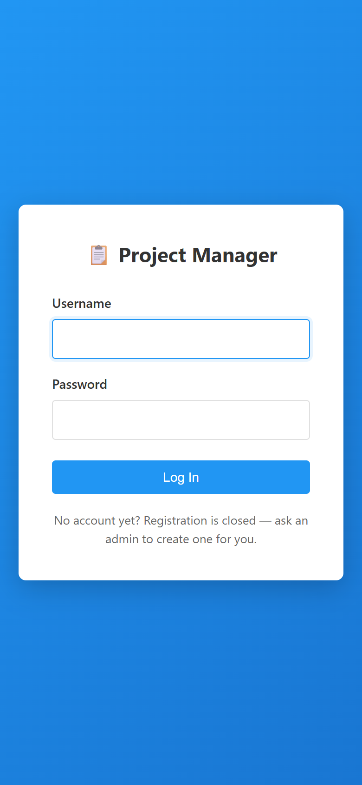 |
| 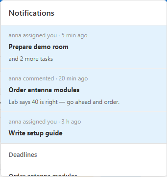 | 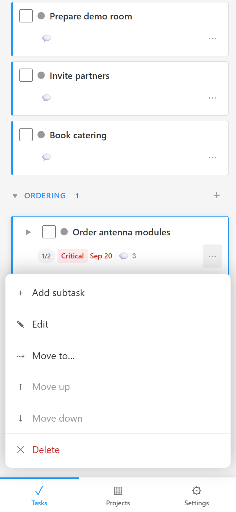 |

<details>
<summary>Settings (your account, archive days, backup &amp; restore, export, updates, users &amp; registration)</summary>

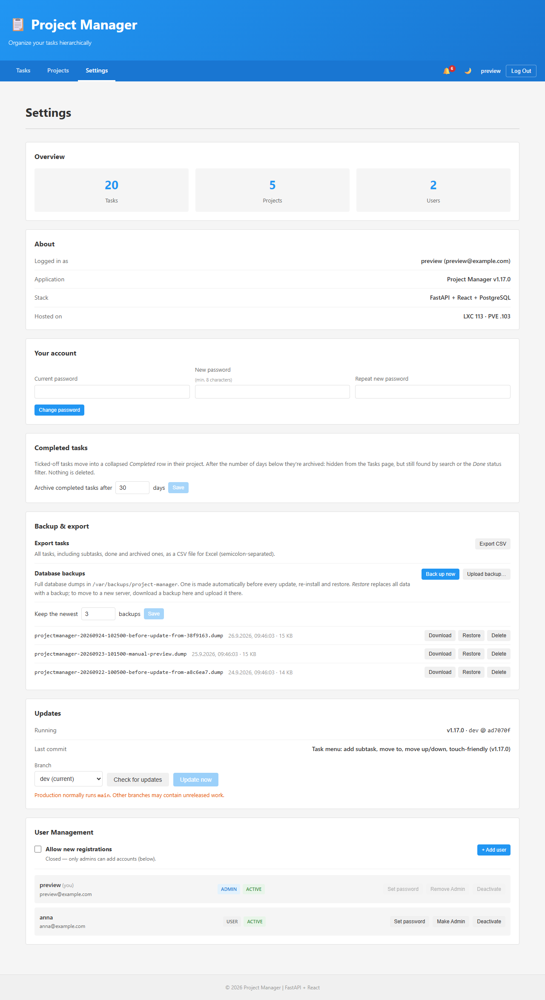

</details>

Screenshots use sample data from a local preview instance.

### On your phone

Open the app's URL in the phone browser and use *Add to Home Screen* (iOS: Share menu; Android/Chrome: ⋮ menu → *Install app*). It then starts full-screen with its own icon. It needs a connection to the server (e.g. over your VPN/ZeroTier when away) — there is no offline mode.

## Releases

See [CHANGELOG.md](CHANGELOG.md) and the [GitHub releases](https://github.com/Boisti13/project-manager/releases).

## Tech Stack

- **Backend**: FastAPI (Python 3.10+) + SQLAlchemy 2.0 + psycopg 3 + PostgreSQL; bcrypt password hashes, JWT sessions (PyJWT)
- **Frontend**: React 18 + React Router, dependency versions locked in `package-lock.json`
- **Deployment**: Bare metal on LXC — Supervisor runs the API, Nginx serves the static React build. A Docker Compose setup also exists for local development but is not the production path.

## Installation

**New Proxmox LXC** (run on the PVE host):

```bash
bash -c "$(curl -fsSL https://raw.githubusercontent.com/Boisti13/project-manager/main/proxmox/project-manager-lxc.sh)"
```

To start the new container from a backup of another instance, put `PM_RESTORE_FILE=/path/to/backup.dump` in front of that command.

**Existing Debian 12 / Ubuntu 22.04+ LXC or VM** (run inside it, as root):

```bash
bash -c "$(curl -fsSL https://raw.githubusercontent.com/Boisti13/project-manager/main/install.sh)"
```

Both install PostgreSQL, Nginx, Supervisor and Node.js without Docker, generate the database password and secret key, build the frontend and print the URL. Register the first account to become admin — registration then closes, and you add further users under **Settings → User Management**. Later updates happen from **Settings → Updates**. Options, unattended mode and the manual steps are in [DEPLOYMENT.md](DEPLOYMENT.md#fresh-install).

## Development Setup

Needs Python 3.11+, Node 18+ and a PostgreSQL database.

### Backend

```bash
cd backend
python -m venv venv
source venv/bin/activate  # or venv\Scripts\activate on Windows
pip install -r requirements.txt
cp .env.example .env      # set DB_* to your database
python migrate.py         # create/upgrade the schema (Alembic)
uvicorn app.main:app --reload --port 8000
```

Schema changes go through Alembic migrations — see [DEPLOYMENT.md](DEPLOYMENT.md#database-migrations).

### Frontend

```bash
cd frontend
npm ci                    # exact versions from package-lock.json
npm start                 # dev server on :3000, proxies /api to :8000
```

`npm run build` produces the static bundle that production serves.

### Docker Compose (alternative)

`docker compose up` starts Postgres, the backend (running `migrate.py` first) and the frontend dev server. Local development only.

## Testing

**Backend** — pytest against a real PostgreSQL:

```bash
cd backend
pip install -r requirements-dev.txt
pytest
```

With no configuration it starts a throwaway PostgreSQL via the `pgserver` package (nothing to install); set `PM_TEST_DATABASE_URL=postgresql://user:pw@host/postgres` to use an existing server instead (the user needs `CREATE DATABASE`). Each run uses its own database and removes it afterwards. The suite covers auth and user management, projects/categories, tasks, comments, settings, export/import, the backup endpoints, the migrations (upgrade/downgrade, models vs. migrations, stamping pre-Alembic databases) and the `backup-db.sh`/`restore-db.sh` scripts including rollback — the script tests need `bash` and the PostgreSQL client tools and are skipped without them.

**Frontend** — Jest:

```bash
cd frontend
npm test                  # taskFilters (search/filter/sort/archive), projects (tree, grouping), exportCsv, bulkParse
```

**CI** — [GitHub Actions](.github/workflows/ci.yml) runs the backend tests (PostgreSQL 16, Python 3.10 and 3.12), the frontend tests and production build, and shellcheck on every push to `main`/`dev` and on pull requests.

## Architecture

```
project-manager/
├── VERSION                  # Single source of truth for the app version
├── .github/workflows/ci.yml # Tests, build and shellcheck on every push
├── backend/
│   ├── app/                 # FastAPI application (routers/, models.py, schemas.py, ...)
│   ├── alembic/versions/    # Database migrations
│   ├── tests/               # pytest suite (real PostgreSQL)
│   └── migrate.py           # Applies migrations; stamps pre-Alembic databases
├── frontend/
│   ├── public/              # index.html, web app manifest, app icons
│   └── src/
│       ├── components/      # React components (TaskList, Settings, UpdatePanel, ...)
│       ├── taskFilters.js   # Pure search/filter/sort/archive logic for the task tree
│       ├── exportCsv.js     # CSV export of all tasks
│       ├── bulkParse.js     # "One task per line" text → task tree
│       ├── recurrence.js    # Repeat settings as text
│       └── projects.js      # Project tree, colors, grouping tasks by project/category
├── install.sh               # Installer for a Debian/Ubuntu LXC or VM (idempotent)
├── proxmox/
│   └── project-manager-lxc.sh # Run on the PVE host: creates an LXC and runs install.sh
├── scripts/
│   ├── update.sh            # In-app updater (fetch, backup, install, migrate, build, sync nginx, restart)
│   ├── backup-db.sh         # pg_dump to /var/backups/project-manager, keeps the newest N
│   ├── restore-db.sh        # Safety backup, restore, migrate; rolls back on failure
│   └── fix-db-encoding.sh   # Converts a SQL_ASCII database to UTF-8 (older installs)
├── deploy/nginx.conf        # Production Nginx config (static build + /api proxy)
├── docs/screenshots/        # README screenshots (sample data)
├── CHANGELOG.md             # What changed in each release
├── docker-compose.yml       # Local dev only, not used in production
└── DEPLOYMENT.md            # LXC deployment, updates, migrations, troubleshooting
```

## Branching Strategy

- `main` — production. **Production runs `main`.**
- `dev` — integration branch for ongoing work
- To test `dev` on the live instance, use Settings → Updates → *Switch to dev*, then switch back to `main` once it's merged
- Merge `dev` → `main` (fast-forward) and tag a release when a set of changes is ready to ship

## Versioning

Semantic versioning (`MAJOR.MINOR.PATCH`), tracked in the `VERSION` file at the repo root — the backend reads it at startup and serves it at `/api/health`. The frontend's `package.json` version is kept in sync.

**Bump the `VERSION` file on every behavior-changing commit** (not just docs/comments), update this README and [CHANGELOG.md](CHANGELOG.md) alongside, and tag the corresponding commit on `main` as `vX.Y.Z`:
- **Patch** (`1.0.x`): bug fixes, no behavior change
- **Minor** (`1.x.0`): new features, backward-compatible
- **Major** (`x.0.0`): breaking changes (API contract, data model requiring migration)

```bash
git tag -a v1.4.0 -m "Description of the release"
git push origin v1.4.0
```

A tag alone shows up under *Tags* on GitHub; draft a GitHub Release from it for it to appear under *Releases*.

---

**Note**: The LXC only ever pulls from GitHub (via Settings → Updates or the manual steps in [DEPLOYMENT.md](DEPLOYMENT.md)) — never push to it or edit files there directly.
