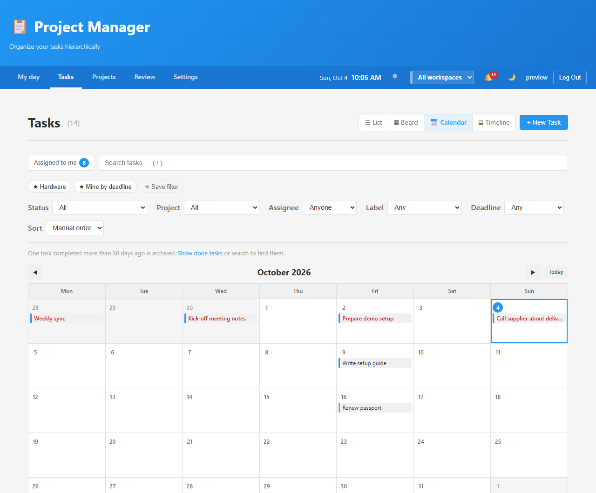

# Project Manager

[](https://github.com/Boisti13/project-manager/actions/workflows/ci.yml)
[](https://github.com/Boisti13/project-manager/releases/latest)
[](https://github.com/Boisti13/project-manager/releases?q=desktop-v&expanded=true)
[](LICENSE)

A self-hosted task manager for a small team: projects with categories,
tasks with subtasks, a list, board and calendar, and a start page that shows
what needs you today. It runs on your own server (one command on Proxmox),
works on phones, speaks English and German, and has a Windows app that keeps
working offline.


## Highlights

- **Projects and categories**, color-coded, with progress; **private projects** only their members see
- **Tasks with subtasks** at any depth — priority, deadline, time estimate, labels, assignee, "waits for" other tasks
- **Repeating tasks**: every N days/weeks/months, on chosen weekdays, the last workday of the month, the 2nd Tuesday …
- **List, board and calendar** views; search, filters and **saved filters**
- **My day** start page and a **weekly review** with open work per project
- **Quick**: type and press Enter, several tasks at once (one per line), **templates**, **keyboard shortcuts**, **change several tasks at once**, **Undo**
- **Comments, history and notifications** for working together
- **Calendar feed** for Outlook, Apple Calendar, Thunderbird or Android
- **Phone-friendly**, installable to the home screen; **dark mode**
- **Windows app** with a local copy: works offline, syncs when back online, updates itself
- **For the server**: one-command install, updates, nightly backups and one-click restore from the app; optional HTTPS; a documented **REST API** with personal tokens

| | | |
|---|---|---|
|  |  |  |
|  |  |  |

More in the **[user guide](docs/user-guide.md)**.

## Install

**New Proxmox LXC** (run on the Proxmox host):

```bash
bash -c "$(curl -fsSL https://raw.githubusercontent.com/Boisti13/project-manager/main/proxmox/project-manager-lxc.sh)"
```

**Existing Debian 12 / Ubuntu 22.04+ LXC or VM** (run inside it, as root):

```bash
bash -c "$(curl -fsSL https://raw.githubusercontent.com/Boisti13/project-manager/main/install.sh)"
```

Both install PostgreSQL, Nginx, Supervisor and Node.js (no Docker) and print
the address. Register the first account to become admin; later updates are
one click in *Settings → Updates*. Options, HTTPS, backups and moving to a
new server: [DEPLOYMENT.md](DEPLOYMENT.md).

## Documentation

| | |
|---|---|
| [User guide](docs/user-guide.md) | Using the app: tasks, views, filters, templates, review, shortcuts, settings |
| [DEPLOYMENT.md](DEPLOYMENT.md) | Installing and running a server: updates, HTTPS, backups and restore, troubleshooting |
| [Windows app](desktop/README.md) | Installing, connecting, working offline, updates |
| [API](docs/API.md) | REST API, tokens, keeping a copy in sync |
| [Development](docs/development.md) | Setup, tests, architecture, branches and versions |
| [CHANGELOG.md](CHANGELOG.md) | What changed in each release ([releases](https://github.com/Boisti13/project-manager/releases)) |

## License

[MIT](LICENSE)
