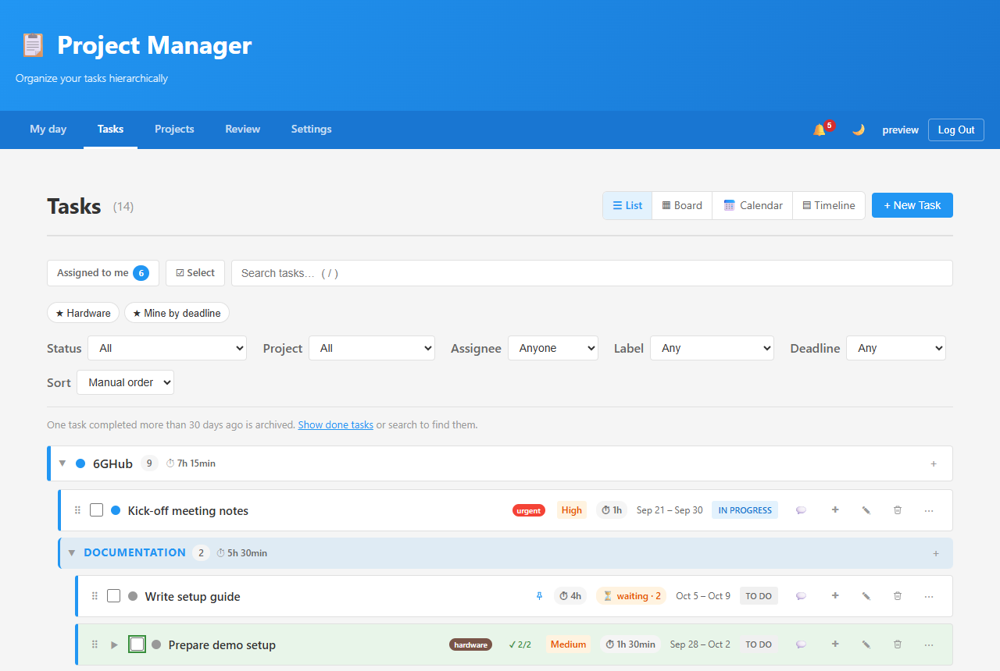
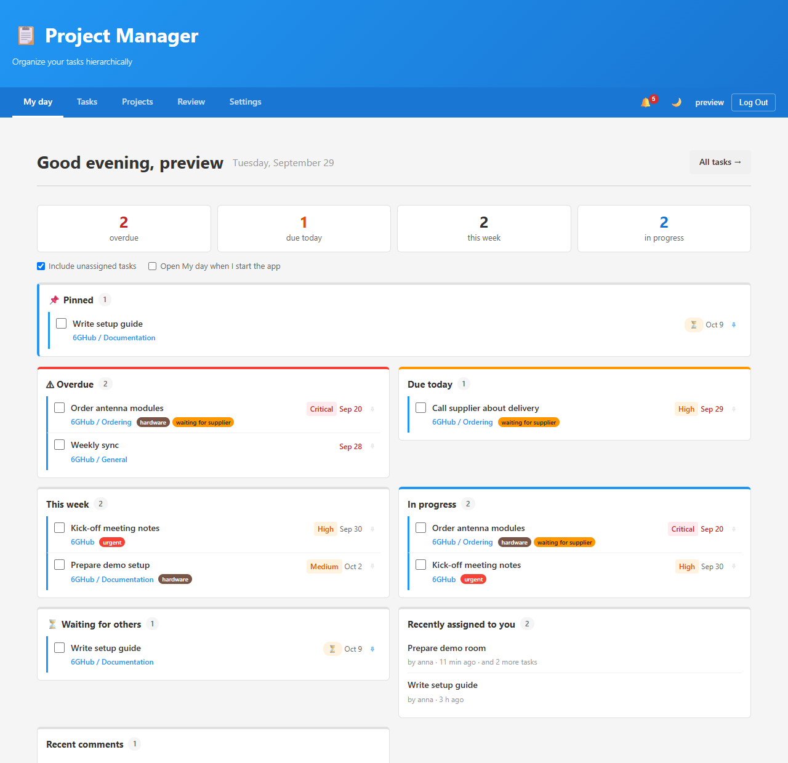
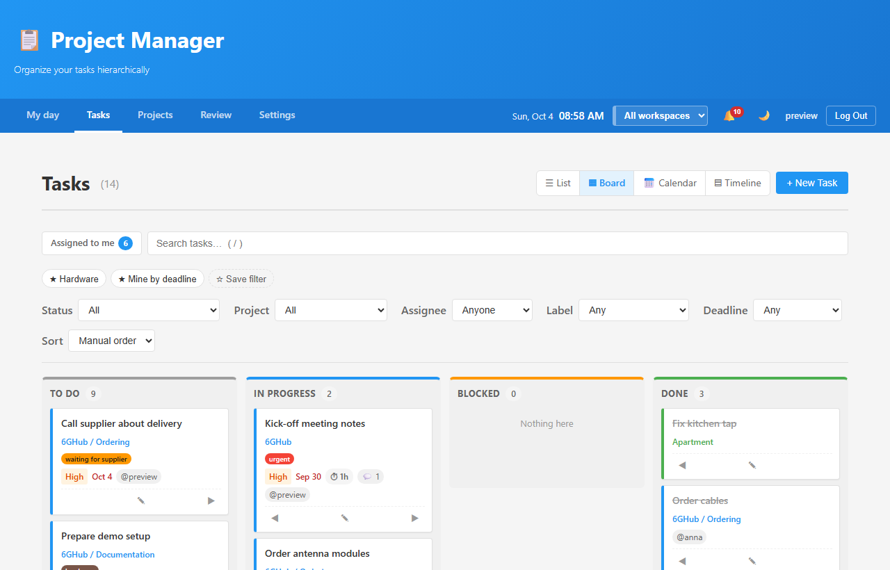
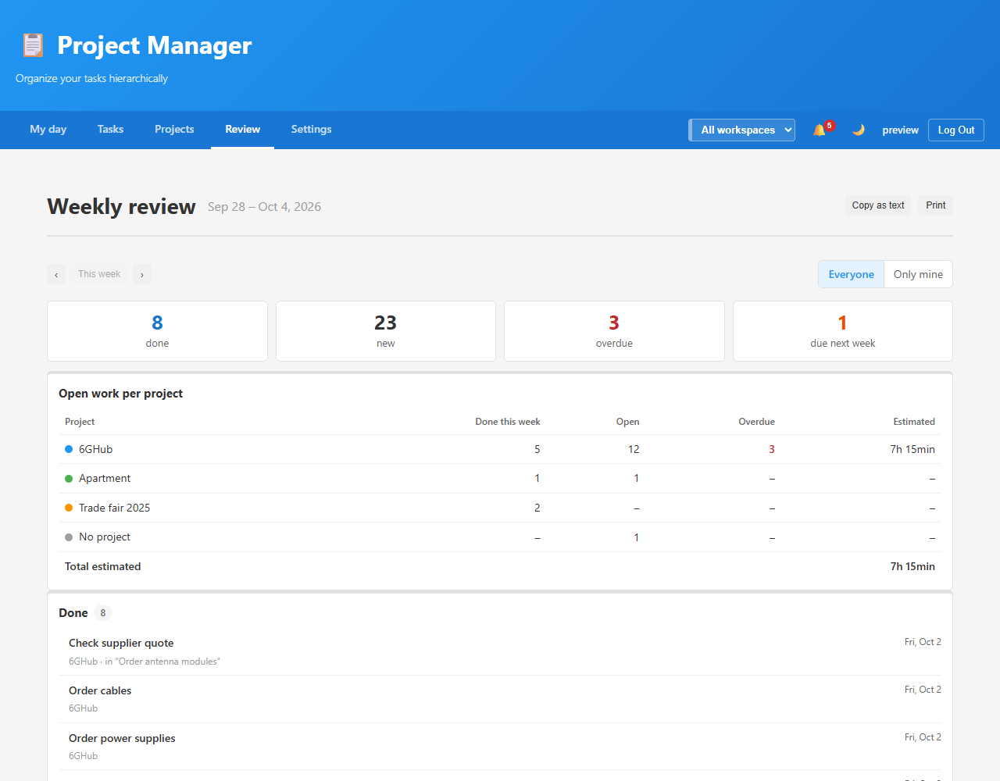
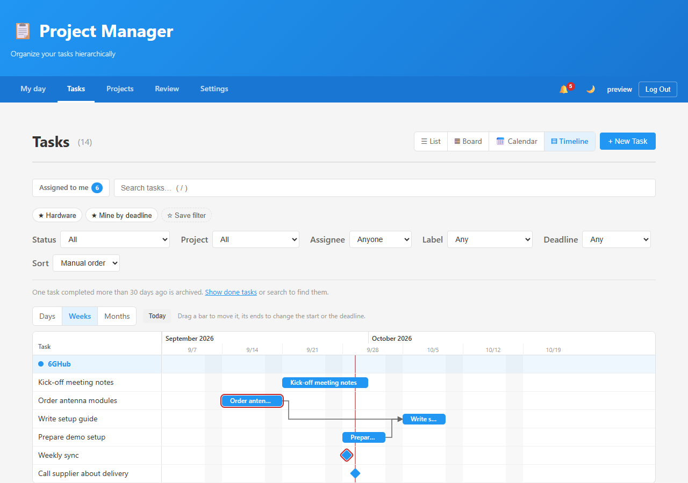
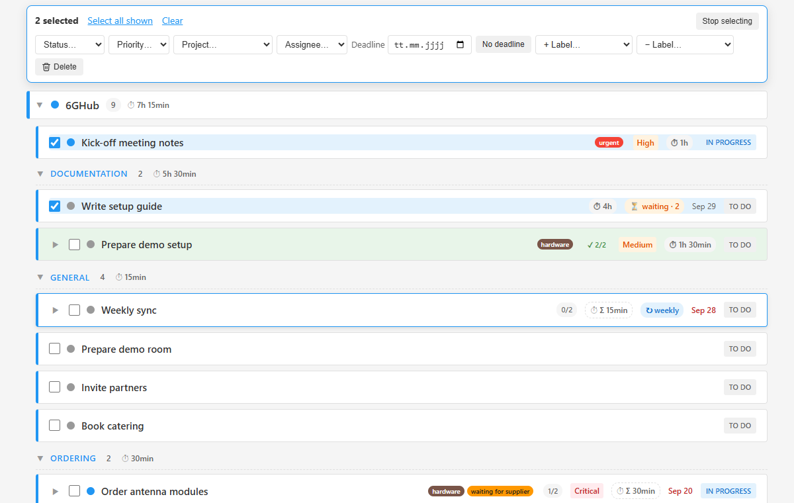
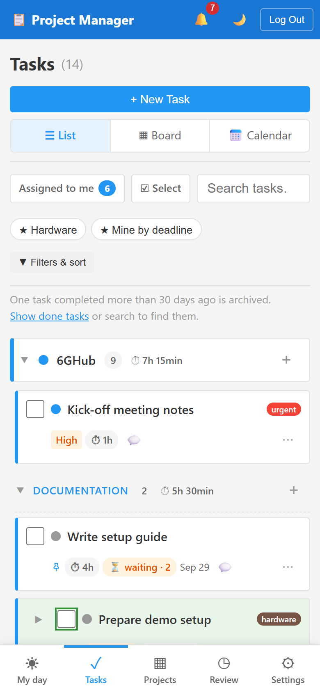
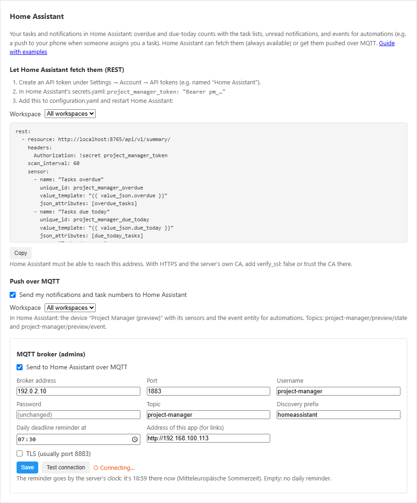

# Project Manager

[](https://github.com/Boisti13/project-manager/actions/workflows/ci.yml)
[](https://github.com/Boisti13/project-manager/releases/latest)
[](#download-the-app)
[](LICENSE)

A self-hosted task manager for a small team: projects with categories,
tasks with subtasks, a list, board and calendar, and a start page that shows
what needs you today. It runs on your own server (one command on Proxmox),
works on phones, speaks English and German, and has a Windows and Linux app that keeps
working offline.



## Download the app

The server is installed on your own machine ([Install](#install));
the **Windows and Linux app** connects to it and works offline too. These
links always get the newest version:

| System | Download |
|---|---|
| Windows 10/11 | [ProjectManager-Windows-x64-setup.exe](https://github.com/Boisti13/project-manager/releases/latest/download/ProjectManager-Windows-x64-setup.exe) |
| Linux, any distribution (x86_64) | [ProjectManager-Linux-x86_64.AppImage](https://github.com/Boisti13/project-manager/releases/latest/download/ProjectManager-Linux-x86_64.AppImage) |
| Linux on ARM, e.g. Raspberry Pi 4/5 | [ProjectManager-Linux-arm64.AppImage](https://github.com/Boisti13/project-manager/releases/latest/download/ProjectManager-Linux-arm64.AppImage) |
| Debian, Ubuntu, Mint (x86_64) | [ProjectManager-Linux-x86_64.deb](https://github.com/Boisti13/project-manager/releases/latest/download/ProjectManager-Linux-x86_64.deb) |
| Raspberry Pi OS, Debian on ARM | [ProjectManager-Linux-arm64.deb](https://github.com/Boisti13/project-manager/releases/latest/download/ProjectManager-Linux-arm64.deb) |

How to install and connect: [desktop/README.md](desktop/README.md#installing).
The web app shows the same links under *Settings*.

## Highlights

- **Projects and categories**, color-coded, with progress; **private projects** only their members see
- **Tasks with subtasks** at any depth — priority, deadline, time estimate, labels, assignee, "waits for" other tasks
- **Repeating tasks**: every N days/weeks/months, on chosen weekdays, the last workday of the month, the 2nd Tuesday …
- **List, board, calendar and timeline (Gantt)** views — drag bars to move dates, arrows for dependencies; search, filters and **saved filters**
- **Workspaces** to keep work and private apart — one switch, every view follows
- **My day** start page with your **pinned tasks**, and a **weekly review** with open work per project
- **Quick**: type and press Enter — *"Call supplier tomorrow !high #hardware @anna"* sets the deadline, priority, label and assignee — several tasks at once (one per line), **templates**, **keyboard shortcuts**, **change several tasks at once**, **Undo**
- **Comments with @mentions, history and notifications** for working together; descriptions and comments with **formatting and clickable links**
- **Archive** finished projects (still searchable), **share a project read-only** with a link — no account needed
- **Calendar feed** for Outlook, Apple Calendar, Thunderbird or Android — all tasks or one workspace
- **[Home Assistant](#home-assistant)**: next task, overdue / due-today sensors with the titles, notification events — fetched (REST) or pushed over **MQTT** with auto-discovery
- **Phone-friendly**, installable to the home screen; **dark mode**
- **Windows and Linux app** (x86_64 and ARM64; installer, AppImage, .deb) with a local copy: works offline, syncs when back online, updates itself
- **Secure logins**: optional **two-factor login** with an authenticator app (with recovery codes), and repeated wrong passwords are slowed down
- **For the server**: one-command install, updates, nightly backups and one-click restore from the app; optional HTTPS; a documented **REST API** with personal tokens

| | | |
|---|---|---|
|  |  |  |
|  |  |  |

More in the **[user guide](docs/user-guide.md)**.

## Home Assistant

Your tasks and notifications in [Home Assistant](https://www.home-assistant.io/):
dashboards, announcements, a push to your phone when someone assigns you a
task, a lamp that turns red while something is overdue. Set it up in the app
under **Settings → Calendar & Home Assistant**. There are two ways, and you
can use both:

| | **Let Home Assistant fetch** (REST) | **Push over MQTT** |
|---|---|---|
| How | HA calls `GET /api/v1/summary/` with an API token every minute | the app sends to your broker (e.g. the Mosquitto add-on) |
| Setup | an API token + YAML that Settings shows ready to copy | an admin enters the broker once; each user ticks *Send my notifications …* |
| Sensors | from the YAML | appear by themselves (MQTT Discovery) as the device *Project Manager (you)* |
| Events for automations | — | ✓ as they happen |
| Daily deadline reminder | — | ✓ at a time you choose |
| Network | HA must reach the app | the app must reach the broker |

**What you get** (each optionally for one [workspace](docs/user-guide.md#workspaces)):

| Sensor | State | Attributes |
|---|---|---|
| **Next task** | the **title** of the most urgent task — overdue first, then due today, then the next days | `task` (project, deadline, priority, link) |
| **Overdue tasks** | how many | `titles` (just the titles), `tasks` (with project, deadline, priority, link) |
| **Due today** | how many | `titles`, `tasks` |
| **Due soon** (next 3 days) | how many | `titles`, `tasks` |
| **Unread notifications** | how many | the latest notification |
| **Assigned to me** | open tasks assigned to you | |

Counted like the bell: open tasks assigned to you or to nobody, not in
archived projects. With MQTT there's also an **event entity** that fires with
`assigned`, `mention`, `comment`, `unblocked` (what a task waited for is
done) and `deadlines` (the daily reminder), each with a ready-made message
in your language, the task title and a link.

**Quick setup — REST**: *Settings → Account → API tokens* → create one; put
`project_manager_token: "Bearer pm_…"` into Home Assistant's `secrets.yaml`;
copy the YAML from *Settings → Calendar & Home Assistant* into
`configuration.yaml`; restart Home Assistant.

**Quick setup — MQTT**: in Home Assistant install the **Mosquitto broker**
add-on, set up the **MQTT** integration and create a login for the app; in
the app (admin) enter broker address, port, login, the reminder time and the
app's address, **Test connection**, tick *Send to Home Assistant over MQTT*,
**Save**; then each user ticks **Send my notifications and task numbers to
Home Assistant** on the same page. The status says *● Connected*.

Example — a push when someone assigns or mentions you:

```yaml
automation:
  - alias: "Tasks: assigned or mentioned"
    triggers:
      - trigger: state
        entity_id: event.project_manager_anna_notification
    conditions:
      - "{{ trigger.to_state.attributes.event_type in ['assigned', 'mention'] }}"
    actions:
      - action: notify.mobile_app_annas_phone
        data:
          message: "{{ trigger.to_state.attributes.message }}"
```

The full guide — every field, more automations (morning reminder, overdue
lamp, dashboard card with today's titles), the data format, MQTT topics and
troubleshooting — is in **[docs/home-assistant.md](docs/home-assistant.md)**.



## Install

**New Proxmox LXC** (run on the Proxmox host):

```bash
bash -c "$(curl -fsSL https://raw.githubusercontent.com/Boisti13/project-manager/main/proxmox/project-manager-lxc.sh)"
```

**Existing Debian 12 / Ubuntu 22.04+ LXC or VM** (run inside it, as root):

```bash
bash -c "$(curl -fsSL https://raw.githubusercontent.com/Boisti13/project-manager/main/install.sh)"
```

Both install PostgreSQL, Nginx, Supervisor and Node.js (no Docker) and print
the address. Register the first account to become admin; later updates are
one click in *Settings → Updates & users*. Options, HTTPS, backups and moving to a
new server: [DEPLOYMENT.md](DEPLOYMENT.md).

## Documentation

| | |
|---|---|
| [User guide](docs/user-guide.md) | Using the app: tasks, views, filters, templates, review, shortcuts, settings |
| [DEPLOYMENT.md](DEPLOYMENT.md) | Installing and running a server: updates, HTTPS, backups and restore, troubleshooting |
| [Windows & Linux app](desktop/README.md) | Installing, connecting, working offline, updates |
| [Home Assistant](docs/home-assistant.md) | Tasks and notifications in Home Assistant: REST sensors or MQTT, automations |
| [API](docs/API.md) | REST API, tokens, keeping a copy in sync |
| [Development](docs/development.md) | Setup, tests, architecture, branches and versions |
| [CHANGELOG.md](CHANGELOG.md) | What changed in each release ([releases](https://github.com/Boisti13/project-manager/releases)) |

## License

[MIT](LICENSE)
