# User guide

How to use Project Manager, page by page. Running a server is described in
[DEPLOYMENT.md](../DEPLOYMENT.md), the Windows and Linux app in
[desktop/README.md](../desktop/README.md).

- [Getting started](#getting-started)
- [My day](#my-day)
- [The Tasks page](#the-tasks-page)
  - [Adding tasks](#adding-tasks) · [Editing](#editing) · [Subtasks](#subtasks)
  - [What a task can have](#what-a-task-can-have): priority, deadline, estimate, labels, waiting for other tasks, repeating
  - [Formatting](#formatting): bold, lists, clickable links
  - [Ticking tasks off](#ticking-tasks-off) · [Undo](#undo)
  - [List, board, calendar and timeline](#list-board-calendar-and-timeline)
  - [Finding tasks](#finding-tasks): search, filters, saved filters
  - [Changing several tasks at once](#changing-several-tasks-at-once)
  - [Templates](#templates)
  - [Keyboard shortcuts](#keyboard-shortcuts)
- [Comments and history](#comments-and-history)
- [Projects and categories](#projects-and-categories): private projects, [archiving](#archiving-finished-projects), [sharing a read-only link](#sharing-a-project-read-only)
- [Workspaces](#workspaces): work and private (or whatever you like) apart
- [Notifications](#notifications)
- [Weekly review](#weekly-review)
- [Calendar feed](#calendar-feed)
- [Settings](#settings)
- [On your phone](#on-your-phone)
- [For admins](#for-admins)

Screenshots use sample data.

## Getting started

Open the server's address in a browser (e.g. `http://192.168.100.113`). The
**first account registered becomes the admin**; after that registration is
closed and admins add further users under *Settings → User Management*
(or open registration there).

The interface is in **English or German** (*Deutsch*): texts, dates,
weekdays, the task history and the CSV export. Each user picks the language
under *Settings → Your account*; until then it follows the browser. The 🌙
button in the top bar switches to **dark mode** (remembered per browser;
by default it follows the system).

When the server is updated while the app is open in a browser tab, a bar
says *Project Manager was updated to version …* — **Reload** to get the new
version (or *Later*).

| | | |
|---|---|---|
| 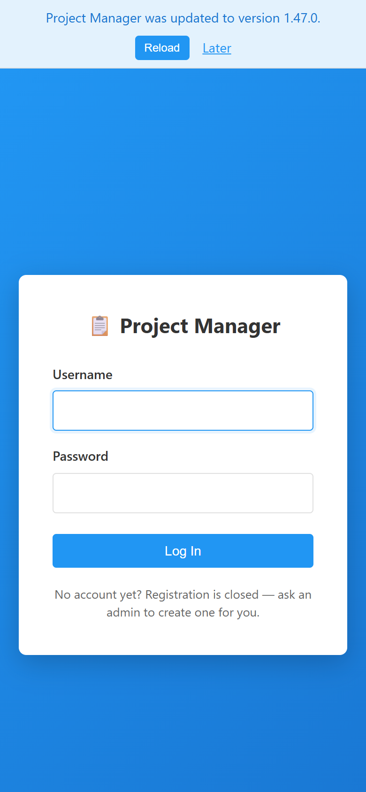 | 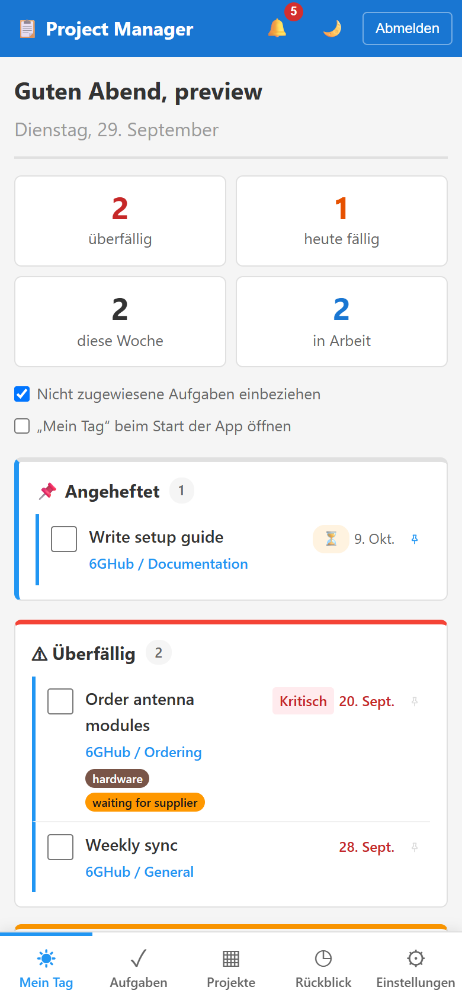 | 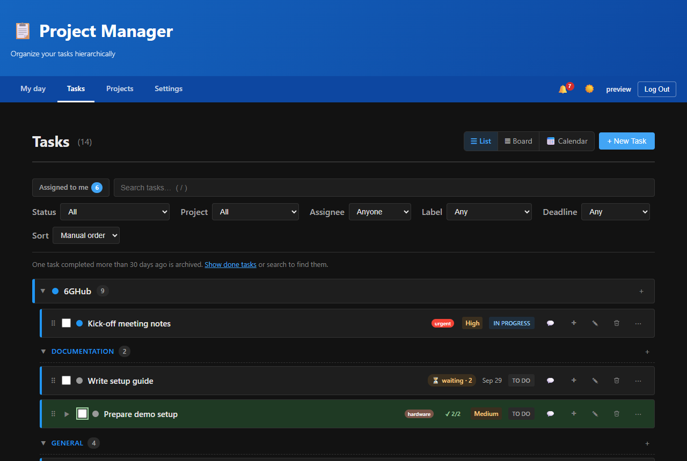 |

## My day

☀ *My day* is a start page with what needs you now: counters and lists of
what's **overdue**, **due today**, **due this week**, **in progress** and
**waiting for others**, plus **recently assigned** tasks and **recent
comments**. It shows your tasks and, if you like, unassigned ones
(*Include unassigned tasks*); subtasks count too. Tick tasks off right there
(with [Undo](#undo)); titles open the task in the list. *Open My day when I
start the app* makes it the start page.

**Pinned tasks** come first: things you want in view whatever their
deadline. Pin a task with the pin button on its row here, with *Pin to My
day* in its ⋯ menu on the Tasks page, or with **p** on the keyboard; pinned
tasks show a pin in the list. Pins are your own — nobody else sees them.
When pinned tasks are done, the section says so and *Unpin them* clears
them.

| | |
|---|---|
|  | 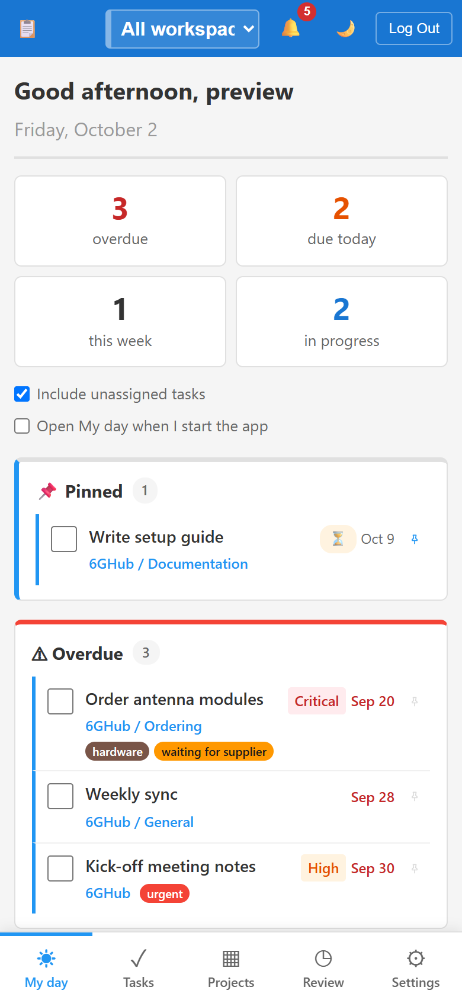 |

## The Tasks page

Tasks are listed in sections per **project** and **category**, each in its
project's color; tasks without a project have their own section. Sections
can be folded (remembered per browser); done tasks move into a collapsed
*✓ Completed* row at the end of their section.


### Adding tasks

- **+ New Task** puts the cursor in the title: type and press **Enter**.
  The **+** on a project or category header adds a task there — the form
  opens right under that header, so you stay where you are.
- The form has *Create* and *Cancel* at the top, staying in view while
  scrolling. **Ctrl+Enter** saves from any field, **Esc** cancels.
- **Several (one per line)** creates many at once: type or paste a list,
  indent lines (Tab or two spaces) to make subtasks at any depth. Bullets
  and Markdown checkboxes (`- [x] done`) are understood, a preview shows the
  resulting tree, and project, status, priority, deadline and assignee apply
  to all of them. From a task's **+**, all lines become its subtasks.
- **From template** creates a saved task with its subtasks again — see
  [Templates](#templates).

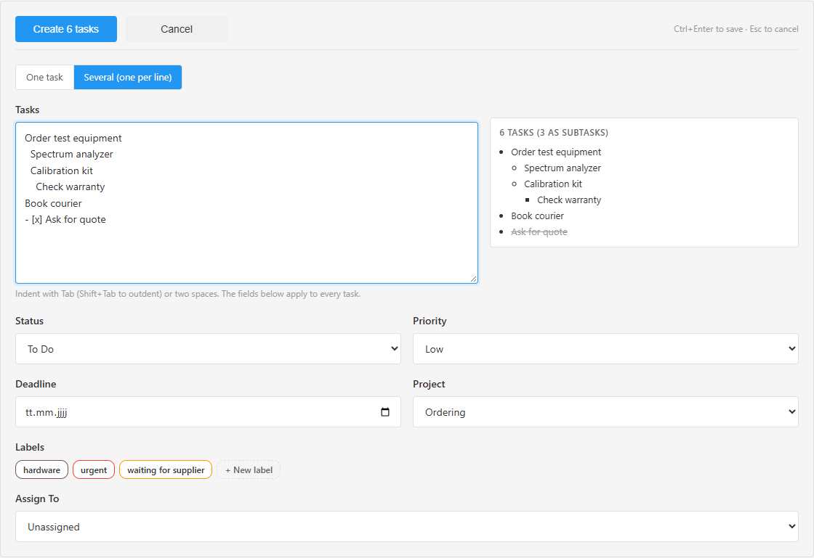

### Editing

**✎ Edit** and **+ Add subtask** open the form right **below that task**, so
there's no scrolling back and forth. The **⋯ menu** on each task has the same
plus *Move to…* another project or category (subtasks come along), *Move up*
/ *Move down*, *Save as template…* and *Delete*.

In *Manual order* (the default sort) tasks can also be **dragged** to a new
place among their siblings.

### Subtasks

Any task can have subtasks, at any depth. The parent shows progress
(e.g. *1/2*); when all subtasks are ticked it's highlighted as ready
(*✓ 2/2*) but stays open — it only moves to *Completed* when you tick it
yourself, so more subtasks can still be added.

### What a task can have

- **Status**: To Do, In Progress, Blocked, Done.
- **Priority**: *Low*, *Medium*, *High* or *Critical*; above Low it shows as
  a colored badge, and lists can be sorted by it.
- **Deadline**: shown on the task, red when overdue.
- **Start** (optional): when work begins. With a start, the task shows its
  dates as a range (*Oct 5 – Oct 9*) and gets a bar on the
  [timeline](#list-board-calendar-and-timeline); the start can't be after the
  deadline. Repeating tasks move their start along with the deadline.
- **Estimate**: how long it will take — type `2h`, `1.5h`, `45m` or `1:30`
  (a plain number means hours). It shows as ⏱ 1h 30min. A task without its
  own estimate shows what its open subtasks add up to (⏱ Σ …). Each project
  and category header shows the **open work, estimated**: done tasks count
  nothing, and a task's own estimate covers its subtasks, so nothing is
  counted twice.
- **Labels**: colored tags like *urgent* or *waiting for supplier*, shared
  across all projects. Pick or create them in the form, manage them under
  *Settings → Labels*. Clicking a label filters by it.
- **Waits for**: other tasks this one depends on. It shows **⏳ waiting**
  until they're done; then its assignee gets a *Ready to start*
  notification. Tasks can't wait for each other in a circle.
- **Repeat**: every N days, weeks, months or years — or on chosen weekdays
  (Mon + Thu, *every workday*), monthly on the last day, the last or first
  workday, or the same weekday (*2nd Tuesday*, *last Friday*), optionally
  counted from when it was done (*3 days after it was done*). Ticking it off
  creates the next one, with the deadline moved forward and the subtasks as
  a fresh checklist. Shown with a ↻ badge.
- **Assignee**: who does it. In a [private project](#projects-and-categories)
  only its members can be assigned.

### Formatting

Descriptions and comments understand a little Markdown:

| Type | Shows as |
|---|---|
| `**bold**`, `*italic*`, `~~struck~~`, `` `code` `` | **bold**, *italic*, ~~struck~~, `code` |
| `https://…` or `[the quote](https://…)` | a clickable link (opens in a new tab; in the Windows/Linux app, in your browser) |
| `- item` or `1. item` on their own lines | a list |
| `- [ ] open` / `- [x] done` | a checklist (for real subtasks, use subtasks) |
| `# Heading`, `> quote`, ```` ``` ```` code block ```` ``` ```` | a heading, a quote, a code block |

Line breaks stay as typed. Search still highlights matches inside formatted
text.

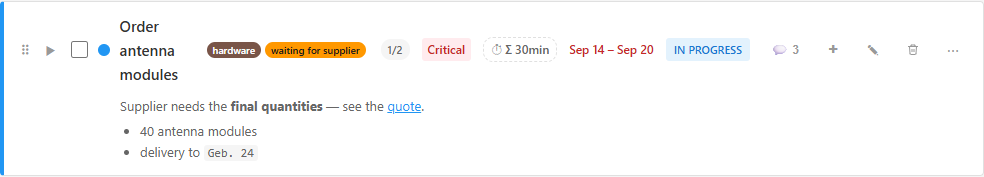

### Ticking tasks off

The checkbox marks a task done; it moves into its section's *✓ Completed*
row (newest first). After a number of days (*Settings → Completed tasks*,
default 30) done tasks are **archived**: hidden from the list, but search
and the *Done* filter still find them. Nothing is deleted.

### Undo

Deleting a task (with its subtasks) or ticking one off shows a bar with
**Undo** for a few seconds — there's no "Are you sure?" for tasks. A
deleted task is only really deleted when that time is up (or when you leave
the page). Undo after ticking off puts the task back to the status it had;
for a repeating task it also takes back the next occurrence it created, as
long as nobody has worked on that one yet.

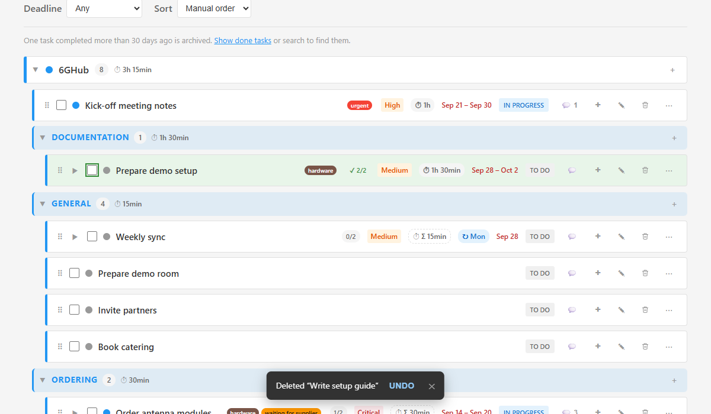

### List, board, calendar and timeline

The switch at the top shows the tasks as

- the **list** (above),
- a **board** with To Do / In Progress / Blocked / Done columns — drag cards
  between columns, or use ◀ ▶,
- a **month calendar** of deadlines (subtasks included) — drag a task to
  another day to move its deadline; on phones days show colored dots and the
  tapped day's tasks are listed below,
- a **timeline** (Gantt chart): each task with dates as a bar from its
  start to its deadline, or a ◆ on the deadline when it has no start, grouped
  by project, with **arrows** from the tasks it waits for. Late tasks are
  outlined in red, done ones faded, today is a red line; zoom in *Days*,
  *Weeks* or *Months*. **Drag a bar** to move the task (start and deadline
  together), **drag its left or right end** to change just the start or the
  deadline — with Undo. Tasks without any dates aren't shown (a note says how
  many).

Search and filters apply to all of them; clicking a task on the board, in
the calendar or on the timeline opens it in the list.

| | | |
|---|---|---|
|  |  | 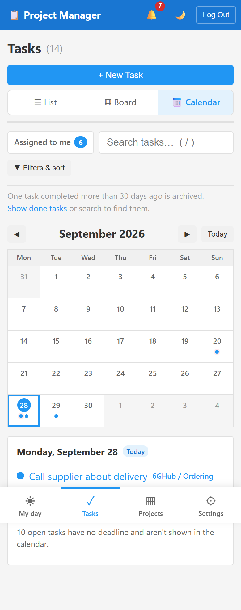 |

| | |
|---|---|
|  | 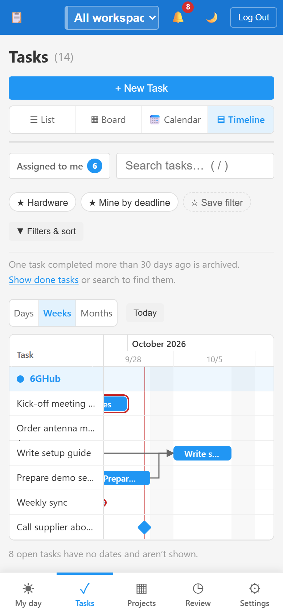 |

### Finding tasks

- **Search** looks through titles, descriptions, comments and labels
  (subtasks included) and highlights the matches; **/** jumps to it.
- **Filters** for status (including *Waiting for other tasks*), project,
  assignee, label and deadline (overdue, due in 7 days, none), and a **sort**
  by deadline, priority, newest or title. Filters are kept in the URL, so a
  link or bookmark brings them back.
- **Assigned to me** next to the search shows only your tasks, with a count
  of your open ones.
- **Saved filters**: *☆ Save filter* keeps the current filters, search, sort
  and view under a name. Its ★ chip brings them back with one click; the
  trash can next to the active one deletes it. They're per user and on every
  device.

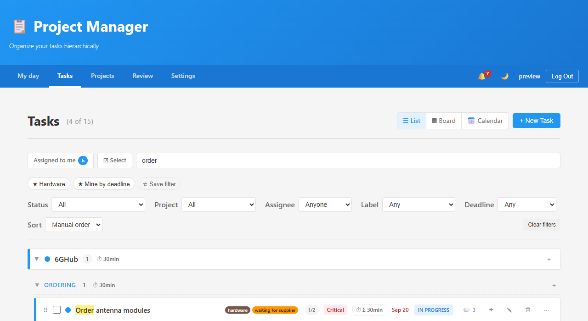

### Changing several tasks at once

**☑ Select** next to *Assigned to me* turns on select mode:

- click tasks to pick them, **Shift+click** for a range, *Select all shown*
  for everything in view (or **Space** on the task picked with the keyboard);
- the bar above the list sets **status, priority, project, assignee,
  deadline**, adds or removes a **label**, or **deletes** the selected tasks
  — as soon as you pick a value;
- every change can be undone, and Undo puts back what **each** task had;
- it's all or nothing: if one task can't take the change (say, an assignee
  who isn't a member of a private project), nothing changes and the reason
  is shown;
- **Esc** or *Stop selecting* ends it.

| | |
|---|---|
|  | 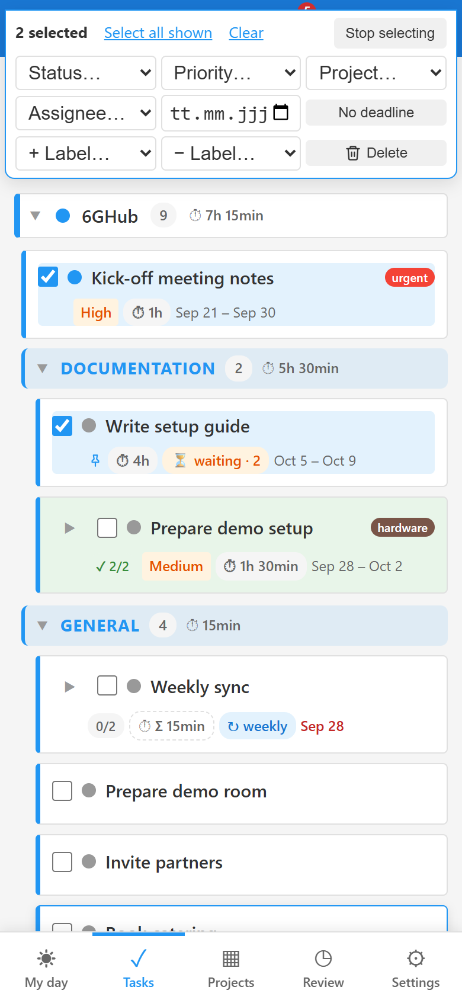 |

### Templates

A template is a task with its subtasks, saved to be created again — a
checklist you repeat, for example.

- ⋯ → **Save as template…** on a task saves it (with its subtasks) under a
  name.
- In the task form, **From template** creates it again: pick the template,
  optionally a new title, and the project, deadline and assignee for this
  round. Titles, descriptions, priorities, estimates and labels come along;
  everything starts as *To Do*. It also works below a task (as subtasks).
- Templates are shared by everyone. *Settings → Task templates* lists them;
  whoever saved one (or an admin) can delete it.

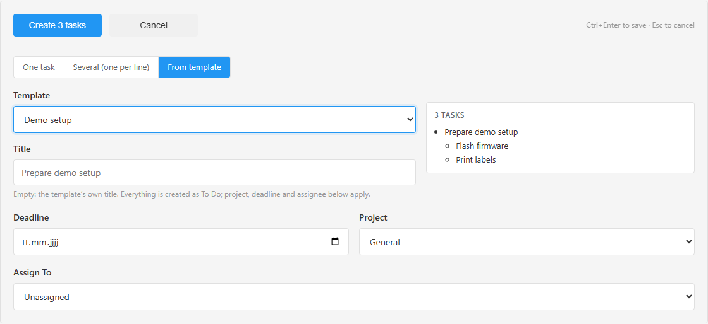

### Keyboard shortcuts

On the Tasks page (not while typing in a field); **?** shows the list.

| Key | |
|---|---|
| **n** | New task |
| **/** | Search |
| **j** / **k** | Next / previous task (the picked task is outlined) |
| **e** | Edit it |
| **x** | Mark it done / not done |
| **a** | Add a subtask |
| **p** | Pin it to My day / unpin it |
| **c** | Comments & history |
| **o** | Open / close its subtasks |
| **Space** | Select it, to change several at once |
| **Del** | Delete it (the selected ones, when selecting) |
| **Esc** | Clear the selection |
| **Ctrl+Enter** | Save the form |
| **w** | Next workspace (on every page, once you have [workspaces](#workspaces)) |

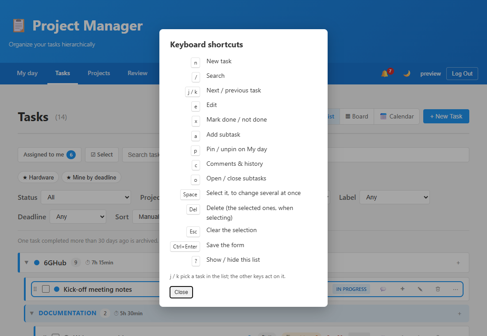

## Comments and history

💬 on a task opens its discussion (the count is shown on the row). Authors
can edit (marked *edited*) and delete their comments; admins can delete any.
Comments can be [formatted](#formatting) like descriptions. Type **@** and a
few letters to **mention** someone: a list suggests people (↑/↓, Enter or
Tab to pick). They get a *… mentioned you* notification — even if the task
isn't theirs — as long as they can see the task; editing a comment only
notifies people who are newly mentioned. The same panel shows the task's
**history** — who created it and who changed
what: status, assignee, project, title, description, deadline, priority,
estimate, repeat, labels, what it waits for — between the comments
(*Hide history* shows comments only).

| | |
|---|---|
| 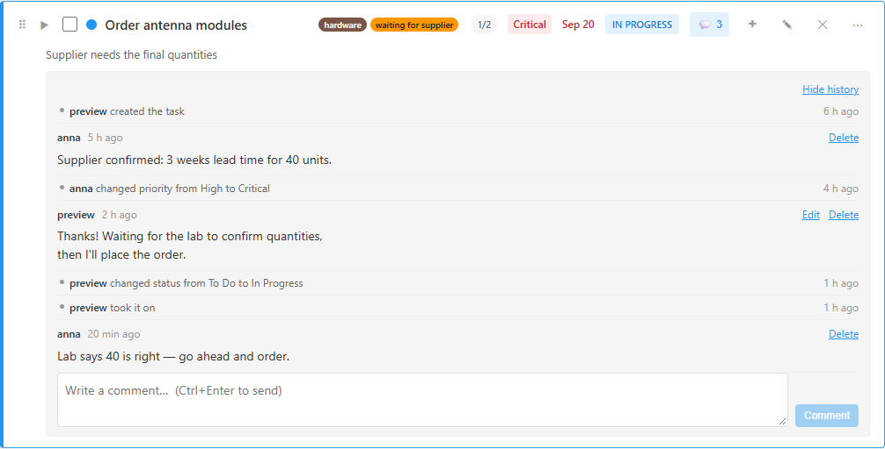 | 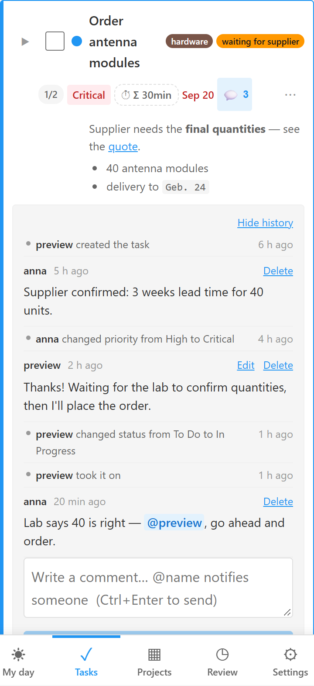 |

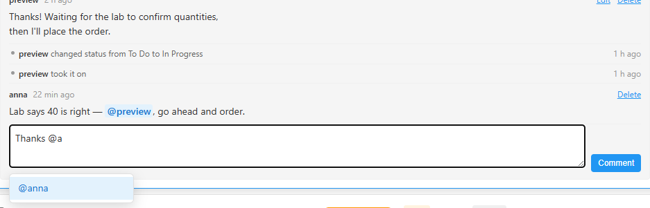

## Projects and categories

The Projects page lists projects, each with a color and one level of
**categories** (e.g. *6GHub → General, Ordering, Documentation*). It shows
each project's **progress** (% done, categories included), open / overdue /
due-this-week counts that open the matching filter, and the next deadline.

Projects are visible to everyone by default. Mark one **🔒 Private** and pick
its members: then the project — its categories, tasks, comments, history,
notifications and exports — is visible only to members and admins. Whoever
creates or manages a private project stays a member.

| | | |
|---|---|---|
| 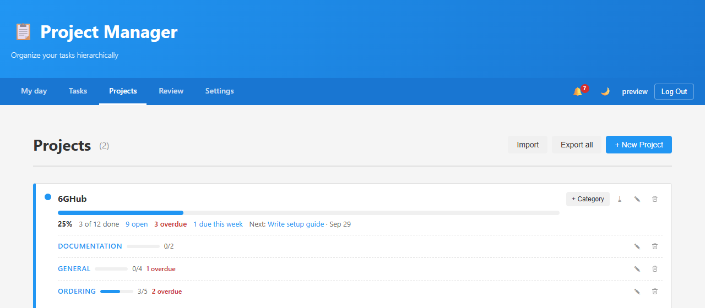 | 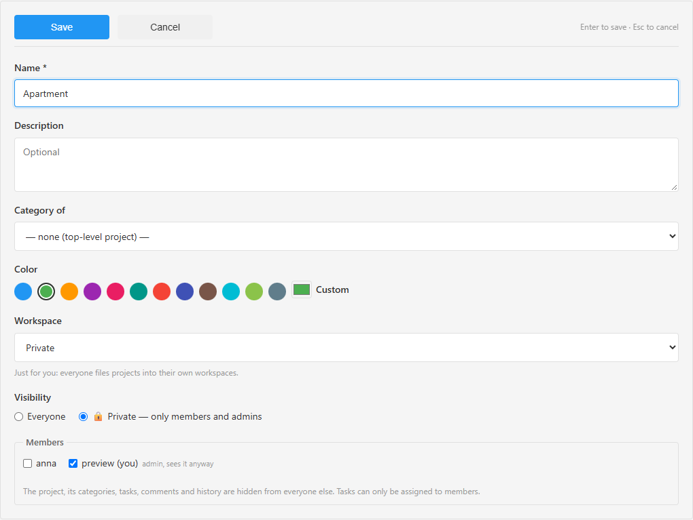 | 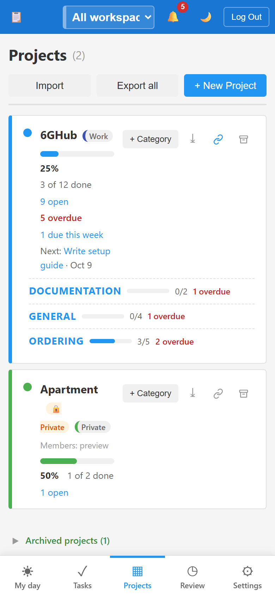 |

### Archiving finished projects

The **box** button on a project archives it (it asks first, and says if
tasks in it are still open). An archived project and its categories:

- disappear from the Tasks page, the project choices (task form, filters,
  *Move to…*, select mode), My day, the bell's deadline reminders, the
  weekly review's open work and the calendar feed;
- are still found by **search**, and the *Project* filter lists them under
  *Archived* — so nothing is lost;
- are listed at the bottom of the Projects page under **Archived projects**,
  with **Restore** to bring one back.

### Sharing a project read-only

The **link** button on a project makes a **read-only link** for someone
without an account — a partner or customer, say. Anyone with the link sees
the project's categories and tasks with their subtasks: titles,
descriptions, status, priorities, deadlines, estimates, labels and the
progress — without logging in, and without being able to change anything.
Comments, history and who does what stay private. The page shows the
current state whenever it's opened.

**Copy** the link to send it; **Stop sharing** makes it stop working (sharing
again makes a new one). A shared project shows its link button in blue.
Whoever can see a project can share it — including private ones, so think
before sharing those.

| | |
|---|---|
| 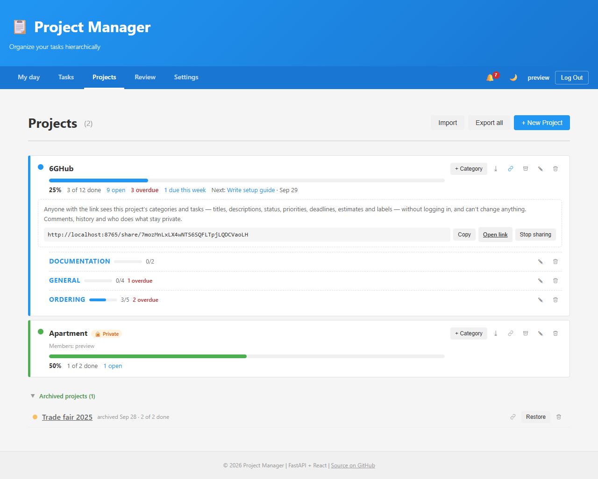 | 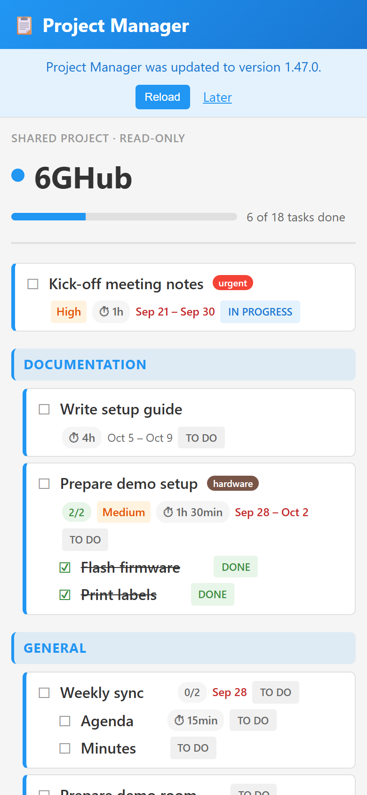 |

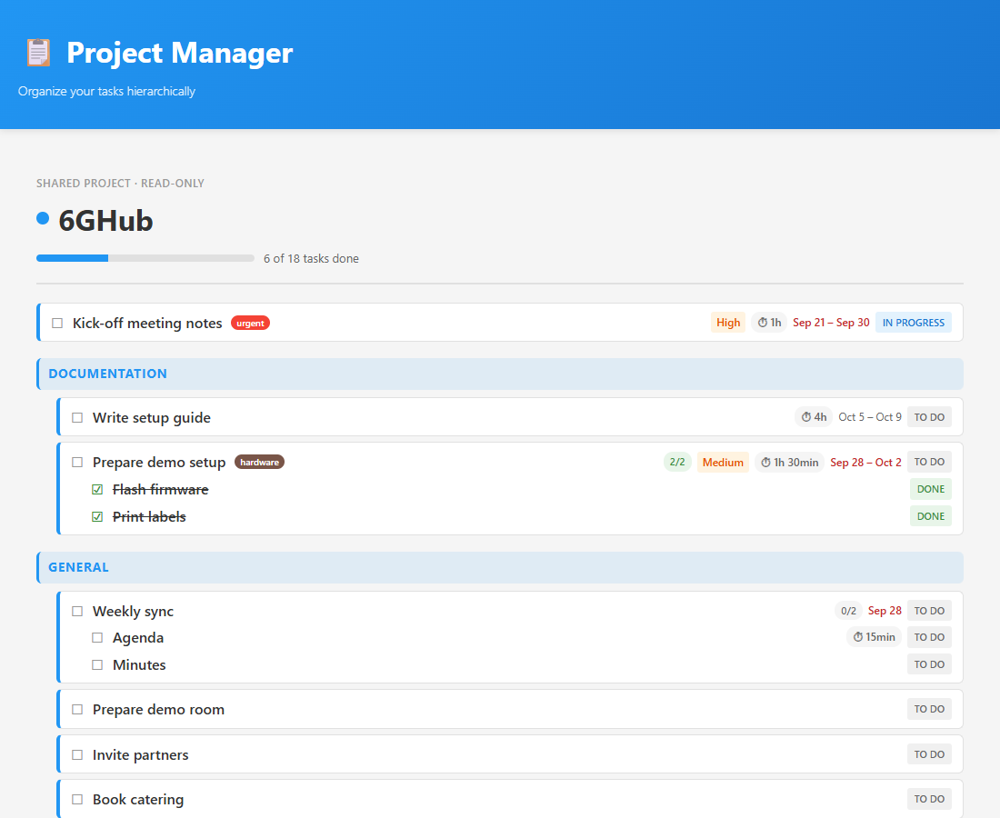

## Workspaces

Keep areas apart — e.g. **Work** and **Private**, or *Club*, *Studies*, …:
each workspace is a group of projects, and the switch in the top bar shows
one at a time, or **All workspaces**.

- **Set them up** under *Settings → Workspaces*: add, rename, recolor,
  reorder (↑ ↓) and delete them. Deleting one keeps its projects; they're
  just in no workspace then.
- **Put a project into one** in the project form (*Workspace*), when creating
  or editing it. A new project goes into the workspace being shown. Under
  *All workspaces* the Projects page shows each project's workspace.
- **What follows the switch**: My day, the Tasks page (list, board, calendar,
  timeline, search and filters), the Projects page, the weekly review and the
  project choices in forms. Categories and subtasks go with their project.
  Notifications, the calendar feed and exports still cover everything.
- **Projects in no workspace** (and tasks without a project) show in every
  workspace, or — set under *Settings → Workspaces* — only under *All
  workspaces*.
- **They're yours**: workspaces are personal. A shared project can be in your
  *Work* and in a colleague's *Lab*; nobody else sees how you filed it.
- The workspace shown is remembered **per device** (e.g. *Work* on the office
  PC, *All* on the phone). **w** switches to the next one.
- The Windows and Linux app shows them offline too; changing them needs a
  connection.

| | |
|---|---|
| 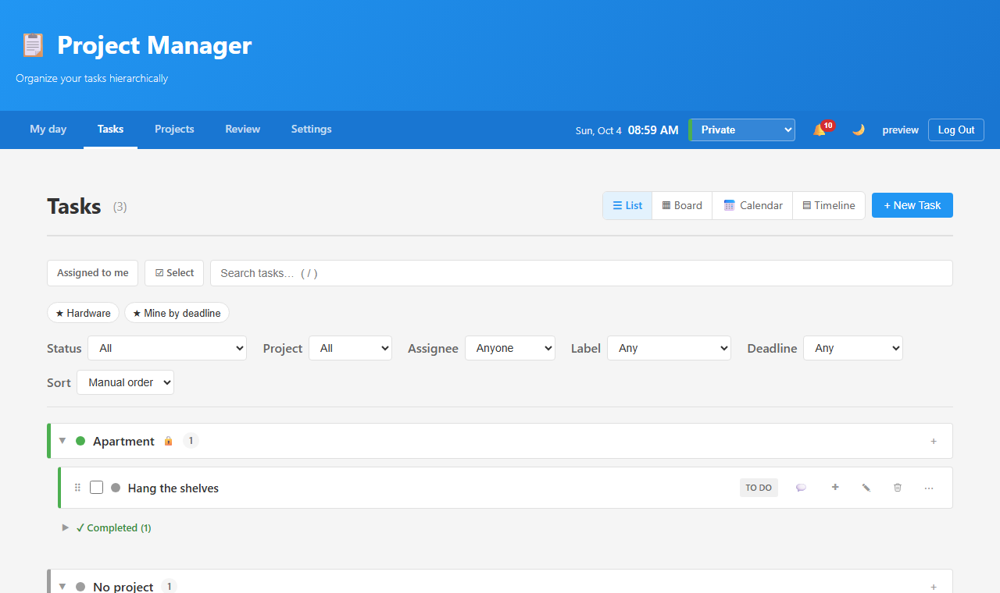 | 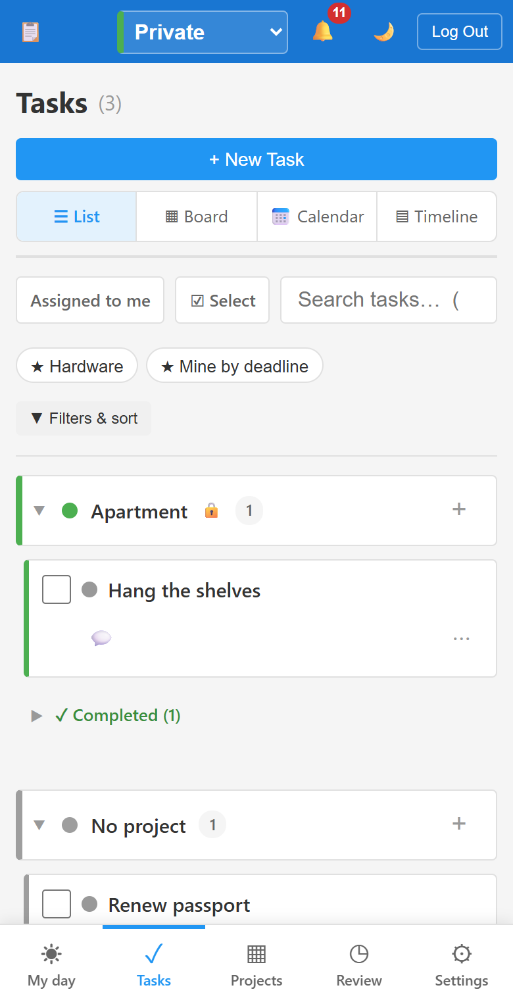 |

## Notifications

The 🔔 in the top bar tells you when someone **assigns you a task** (several
at once count as one), **mentions you** in a comment, **comments** on a task
you're assigned to or have commented on, or **finishes the last task one of yours waited for** — plus
overdue and soon-due deadlines of your (and unassigned) tasks. Clicking one
opens the task, with its project, parents and comments opened on the way.

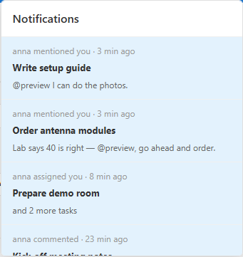

## Weekly review

◷ *Review* shows a week at a time (‹ *This week* ›):

- how many tasks got **done** and how many are **new**, what's **overdue**
  and what's **due the week after**, each as a list;
- **open work per project**: done this week, open, overdue and estimated
  hours, with a total;
- *Everyone* or *Only mine*;
- **Copy as text** gives a plain-text summary for a status mail, **Print**
  prints just the review.

| | |
|---|---|
|  | 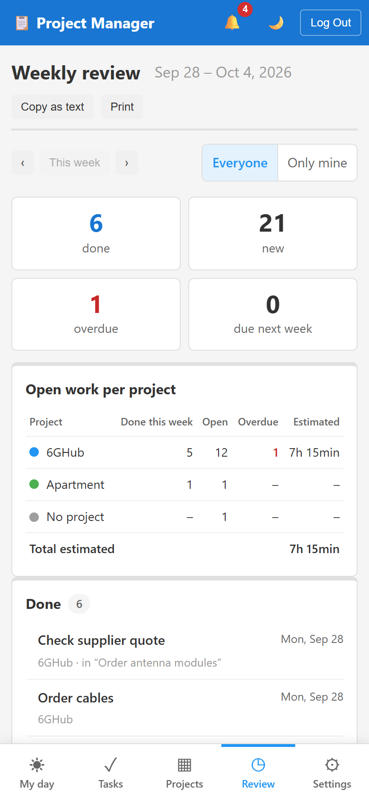 |

## Calendar feed

*Settings → Calendar feed* gives you a private link that calendar apps
subscribe to: your open tasks with a deadline as all-day entries, repeating
tasks as series, updated about every hour. Choose *Mine and unassigned* or
*Everything I can see*. **New link** replaces it (the old one stops
working). Keep the link private — anyone with it can see these tasks.

It works with apps that fetch the feed on the device: classic Outlook, Apple
Calendar (iPhone, Mac), Thunderbird, and **ICSx⁵** on Android. Google
Calendar, Outlook.com and the new Outlook fetch from their own servers,
which can't reach a server on a private network or VPN.

## Settings

- **Your account**: language, password.
- **Workspaces**: see [above](#workspaces).
- **API tokens**: personal tokens for scripts and other apps
  (see [docs/API.md](API.md)).
- **Calendar feed**: see [above](#calendar-feed).
- **Completed tasks**: after how many days done tasks are archived.
- **Labels** and **Task templates**: rename, recolor, delete.
- **Backup & export**: export a project (or everything) as a JSON file to
  import into another account or installation, or all tasks as a CSV file
  for Excel; admins also make and restore backups here.
- **Windows app** / **Linux app** (only in the app): connection, sync and updates.
  In the browser, **Windows and Linux app** has the download links instead
  (the one for your system marked).

Admins also see backups, updates and user management — see
[For admins](#for-admins).

## On your phone

The app is made for phones too: a tab bar at the bottom, two-line task rows
with large touch targets, a ⋯ menu that opens from the bottom, and filters
folded away behind a button.

Open the server's address in the phone's browser and use *Add to Home
Screen* (iPhone: Share menu; Android/Chrome: ⋮ → *Install app*). It then
starts full-screen with its own icon. It needs a connection to the server
(e.g. over VPN/ZeroTier when you're away); for working offline, there's the
[Windows and Linux app](../desktop/README.md).

| | | |
|---|---|---|
|  | 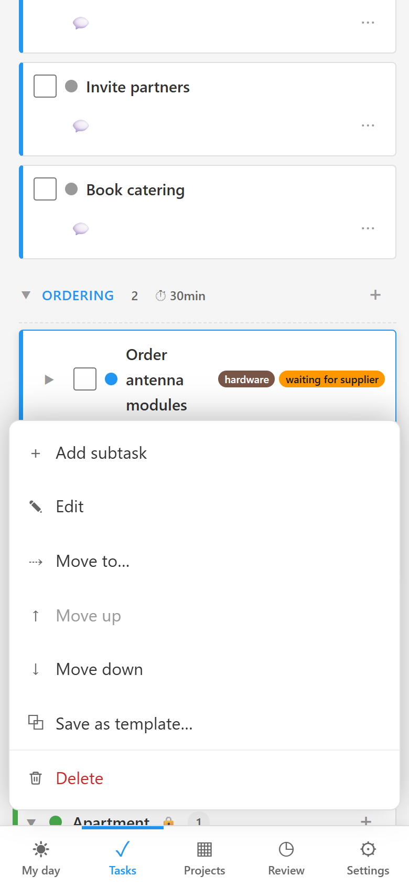 | 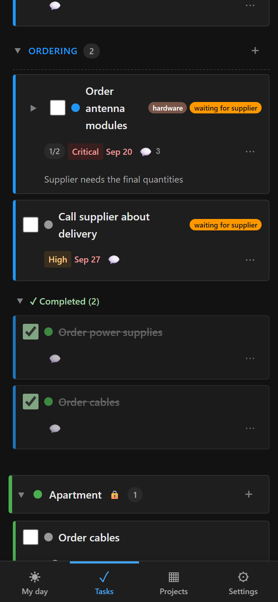 |

## For admins

- **Users** (*Settings → User Management*): add accounts, set passwords,
  make admins, deactivate users (locked out at once), and open or close
  self-registration.
- **Updates** (*Settings → Updates*): shows the running version; admins
  update or switch branches with a live log (backup first, then fetch,
  migrate, rebuild, restart).
- **Backups** (*Settings → Backup & export*): a backup every night and
  before every update; *Back up now*, download, upload and one-click
  **restore** (with a safety backup and rollback).

Details — installing, HTTPS, restoring, moving to a new server — are in
[DEPLOYMENT.md](../DEPLOYMENT.md).

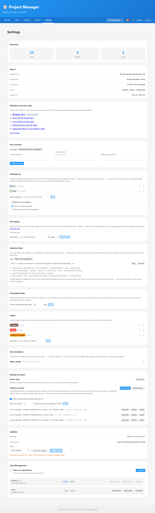
